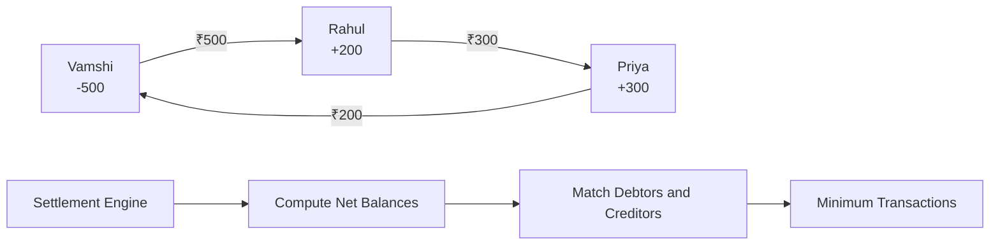
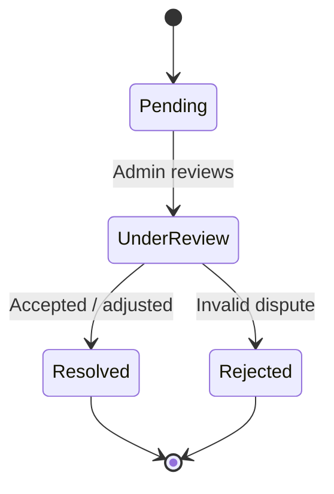
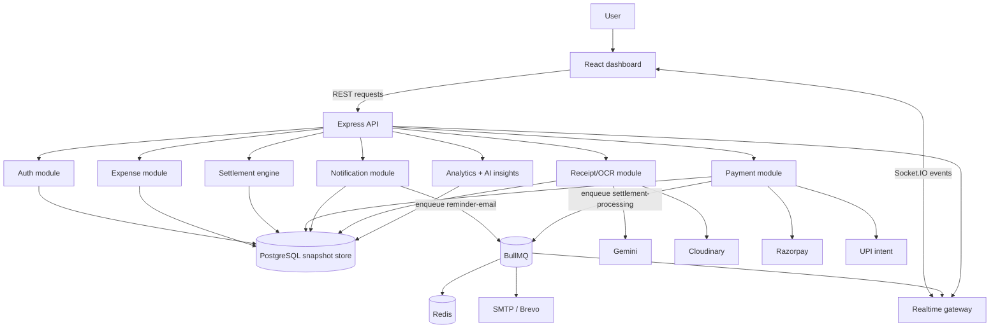
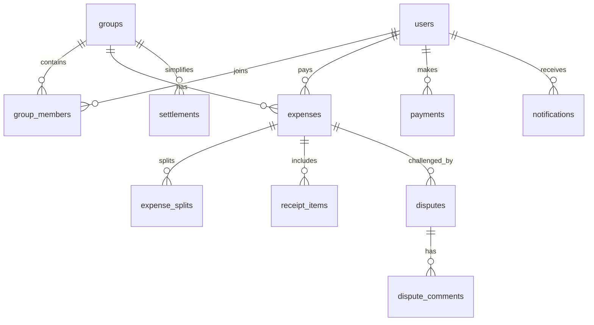
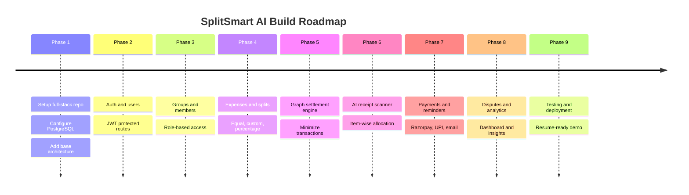
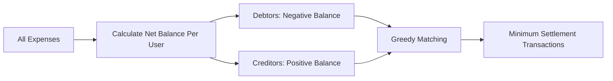

<div align="center">

# 💸 SplitSmart AI

### AI-Powered Intelligent Expense Splitting Platform

**Splitwise + AI Bill Scanner + UPI Settlements + Analytics + Dispute Handling**


**A production-style full-stack project built to demonstrate real SDE skills: authentication, database design, AI/OCR, payments, graph algorithms, analytics, notifications, and dispute workflows.**

[Live Deployment](#-live-deployment) •
[Environment](#-environment-configuration) •
[Core Idea](#-core-idea) •
[Features](#-features) •
[Tech Stack](#-tech-stack) •
[Architecture](#-system-architecture) •
[Production Systems](#-production-systems) •
[Database](#-database-design) •
[Run Locally](#-run-locally) •
[Resume Impact](#-resume-impact)

</div>

---

## 🚀 Live Deployment

| Layer | URL |
| --- | --- |
| Frontend | https://splitsmart-ai-client.vercel.app |
| Backend API | https://splitsmart-ai-api.onrender.com |
| Health Check | https://splitsmart-ai-api.onrender.com/api/health |
| GitHub | https://github.com/vamshichethan/SplitSmart-AI-Intelligent-Expense-Splitting-Platform |

Demo login:

```text
email: vamshi@example.com
password: password123
```

Production deployment uses Vercel for the React client and Render for the Express API. The API supports durable state snapshots through PostgreSQL when `DATABASE_URL` is configured, and safely falls back to in-memory demo data for local development.

## ✅ Current Production Features

- JWT authentication with bcrypt password hashing and protected API routes.
- Customer-ready onboarding: new users start with their own empty group instead of hardcoded demo members.
- Group creation, member add/remove, expense entry, equal/custom/percentage/item-wise splits.
- Receipt image upload through Cloudinary and receipt text extraction through Gemini.
- Settlement graph engine that minimizes repayment transactions.
- Real-world settlement actions: UPI intent copy, Razorpay Checkout for card/UPI/netbanking, and cash/manual confirmation.
- Razorpay payment confirmation endpoint with signature verification when live/test keys are configured.
- BullMQ + Redis queue support for reminder emails and settlement processing, with a safe inline fallback for local demos.
- Socket.IO real-time updates for expenses, settlements, and notifications.
- Brevo SMTP-compatible reminder emails with reminder history.
- Dispute creation, comment threads, resolution workflow, analytics charts, and Gemini spending insights.
- Docker, Docker Compose, and GitHub Actions CI for production-style delivery.

## 🔐 Environment Configuration

### Frontend

| Variable | Example | Purpose |
| --- | --- | --- |
| `VITE_API_BASE_URL` | `https://splitsmart-ai-api.onrender.com/api` | Points the Vercel frontend to the Render API |
| `VITE_SOCKET_URL` | `https://splitsmart-ai-api.onrender.com` | Optional Socket.IO origin; defaults to the API origin derived from `VITE_API_BASE_URL` |

### Backend

| Variable | Required | Purpose |
| --- | --- | --- |
| `CLIENT_ORIGIN` | Yes | Comma-separated allowed frontend origins for CORS |
| `JWT_SECRET` | Yes | Signs JWT sessions |
| `DATABASE_URL` | Recommended | PostgreSQL state persistence |
| `REDIS_URL` | Optional | Redis connection for BullMQ reminder and settlement jobs |
| `GEMINI_API_KEY` | Optional | Gemini receipt extraction and AI insights |
| `GEMINI_MODEL` | Optional | Defaults to `gemini-2.0-flash` |
| `RAZORPAY_KEY_ID` | Optional | Razorpay Checkout test/live key id |
| `RAZORPAY_KEY_SECRET` | Optional | Razorpay order auth and signature verification |
| `CLOUDINARY_CLOUD_NAME` | Optional | Receipt image storage |
| `CLOUDINARY_API_KEY` | Optional | Receipt image storage |
| `CLOUDINARY_API_SECRET` | Optional | Receipt image storage |
| `SMTP_HOST` | Optional | Brevo: `smtp-relay.brevo.com` |
| `SMTP_PORT` | Optional | Brevo: `587` |
| `SMTP_USER` | Optional | Brevo SMTP login |
| `SMTP_PASS` | Optional | Brevo SMTP key |

Missing optional provider keys do not break local development. The app uses safe local/mock fallbacks for AI, Razorpay, Cloudinary, email, and queues while clearly showing provider status in the UI.

---

## 🧪 Run Locally

```bash
npm install
npm run dev
```

Open the Vite client at `http://localhost:5173` and use the demo login:

```text
email: vamshi@example.com
password: password123
```

For the production-style local stack with Redis and PostgreSQL:

```bash
docker compose up --build
```

Useful verification commands:

```bash
npm test
npm run test:jest
npm run build
```

---

## 🎯 Core Idea

> **Most expense apps split totals. SplitSmart AI understands the bill, assigns items, simplifies debt, reminds users, tracks disputes, and explains spending behavior.**

SplitSmart AI helps groups manage shared expenses from start to settlement:

- 🧾 Upload a restaurant bill or receipt
- 🤖 Extract items, prices, tax, service charge, and total using AI/OCR
- 👥 Assign items to people
- 🧮 Split by equal, custom, percentage, or item-wise logic
- 🔁 Manage recurring expenses and shared subscriptions
- 📉 Simplify balances using graph algorithms
- 💳 Settle through Razorpay test mode, UPI intent, or manual confirmation
- 🔔 Send payment reminders with overdue tracking
- ⚖️ Raise and resolve disputes
- 📊 View spending analytics and AI insights

---

## ✨ Features

### 1. 👥 Group Expense Management

| Feature | Description |
| --- | --- |
| 🏘️ Groups | Create groups for trips, roommates, events, teams, or subscriptions |
| 👤 Members | Add friends and manage group members |
| 🛡️ Roles | Group admin and member permissions |
| 💰 Expenses | Add payer, amount, category, date, notes, and receipt |
| 📌 Balances | Track who paid, who owes, and group-level dues |

### 2. ⭐ AI Bill Scanner

Users upload a bill image. The AI scanner extracts structured data from the receipt.

| Extracted Field | Example |
| --- | --- |
| 🍕 Items | Pizza, Coke, Veg Meals |
| 💵 Prices | ₹450, ₹80, ₹220 |
| 🧾 Tax | GST, VAT, restaurant tax |
| 🍽️ Service Charge | 5% or fixed service fee |
| 🎯 Total | Final payable amount |

Example item allocation:

| Bill Item | Assigned To | Split Style |
| --- | --- | --- |
| 🍕 Pizza | Vamshi, Rahul | Shared equally |
| 🥤 Coke | Rahul | Rahul only |
| 🍱 Veg Meals | Priya | Priya only |
| 🧾 Service Charge | Everyone | Proportional |

### 3. 🧠 Smart Split Logic

| Split Mode | Use Case |
| --- | --- |
| ⚖️ Equal Split | Everyone pays the same amount |
| 🎛️ Custom Split | Manually enter exact amounts |
| 📊 Percentage Split | Split by percentage contribution |
| 🧾 Item-wise Split | Assign receipt items to people |
| 🔁 Recurring Split | Rent, subscriptions, monthly bills |
| 📦 Shared Subscription | Netflix, Spotify, cloud tools, etc. |

### 4. 📉 Balance Simplification

Instead of showing messy repayment chains, SplitSmart AI calculates minimum practical settlements.

```text
Before simplification:
A owes B ₹500
B owes C ₹300
C owes A ₹200

After simplification:
A owes B ₹300
B owes C ₹300
```

This is powered by a **net-balance graph algorithm**:



### 5. 🔔 Payment Reminders

- 📅 Due dates
- 📧 Email reminders
- 📱 Optional WhatsApp/SMS reminders
- ⏰ Reminder frequency: once, daily, weekly, custom
- 🚨 Overdue status
- 🗂️ Notification history

### 6. 💳 UPI and Payment Integration

| Payment Flow | Status |
| --- | --- |
| 🧪 Razorpay test mode | Implemented |
| 🇮🇳 UPI intent links | Implemented |
| ✅ Card / UPI / netbanking checkout | Implemented through Razorpay Checkout |
| ✅ Cash / manual confirmation | Implemented |
| 📜 Payment history | Implemented |
| 🧾 Settlement receipt | Roadmap |

### 7. ⚖️ Dispute System

When someone disagrees with an expense, they can raise a dispute.



Dispute features:

- 📝 Raise dispute with reason
- 💬 Comment thread
- 📎 Optional evidence
- 🛡️ Admin resolution
- ✅ Status: pending, under review, resolved, rejected

### 8. 📊 Analytics Dashboard

| Dashboard Metric | What It Shows |
| --- | --- |
| 📆 Monthly spending | Spending over time |
| 🏘️ Group-wise spending | Which groups cost the most |
| 🏷️ Category spending | Food, travel, rent, subscriptions |
| 🥇 Top spender | Highest spender in a group |
| ⏳ Pending dues | Unpaid balances |
| 📈 Settlement trends | How quickly people settle |

### 9. 🤖 AI Spending Insights

AI-generated insights can explain behavior in natural language:

> "You spent 42% more on food this month."

> "Your group's highest shared expense category is travel."

> "Rahul usually delays settlements by more than 5 days."

> "Subscriptions increased compared to last month."

### 10. 🔐 Authentication and Roles

- JWT authentication
- Password hashing with bcrypt
- Refresh token support
- Protected API routes
- Google login optional
- Group admin/member access control

---

## 🛠️ Tech Stack

### Frontend

| Technology | Purpose |
| --- | --- |
| ⚛️ React | Frontend UI |
| 🎨 CSS Modules / Custom CSS | Responsive dashboard styling |
| 🔄 Fetch API | API communication |
| 📊 Recharts | Analytics charts |
| ✅ Vite | Production build tooling |
| 🔌 Socket.IO Client | Live dashboard refresh after expense, settlement, and notification events |

### Backend

| Technology | Purpose |
| --- | --- |
| 🟢 Node.js | Runtime |
| 🚂 Express.js | REST API |
| 🔐 JWT | Authentication |
| 🔒 Bcrypt | Password hashing |
| 📦 Multer | Receipt uploads |
| 📧 Nodemailer | Email reminders |
| 🧪 Zod / Joi | Request validation |
| 🔌 Socket.IO | Real-time dashboard events |
| 🧰 BullMQ | Redis-backed background jobs |
| 🧪 Jest / Supertest | HTTP integration tests |

### Database and Services

| Technology | Purpose |
| --- | --- |
| 🐘 PostgreSQL | Relational database |
| 🧾 PostgreSQL snapshot persistence | Durable deployed demo state |
| ⚡ Redis | Queue backend for reminders and settlement jobs |
| 🤖 Gemini API | AI receipt extraction and insights |
| 💳 Razorpay | Test/live checkout orders and signature verification |
| ☁️ Cloudinary | Receipt image storage |
| 📧 Brevo SMTP | Email reminders |

---

## 🏗️ System Architecture



---

## ⚙️ Production Systems

### Redis + BullMQ Queue

SplitSmart AI now includes a production-style background job layer:

| Queue Job | Trigger | What It Does |
| --- | --- | --- |
| `reminder-email` | User sends expense reminders | Sends reminder email through SMTP/Brevo, updates notification status, persists state, broadcasts a realtime notification update |
| `settlement-processing` | Razorpay/manual settlement is completed | Processes settlement side effects, persists state, broadcasts settlement progress |

When `REDIS_URL` is configured, jobs run through BullMQ and Redis with retry/backoff. When Redis is not configured, the app uses an inline worker fallback so local development and demos still work correctly.

### WebSockets

The API initializes a Socket.IO gateway on the same HTTP server as Express. The React app subscribes to the active group and refreshes the dashboard when these events arrive:

| Event | Purpose |
| --- | --- |
| `expense:created` | Refreshes balances, expenses, analytics, and settlements after a new expense or receipt expense |
| `settlement:updated` | Refreshes payment history and outstanding settlements after UPI/manual/Razorpay actions |
| `settlement:processed` | Confirms queued settlement processing completed |
| `notification:created` | Refreshes reminder history after reminder jobs are queued |
| `notification:updated` | Refreshes reminder delivery state after email processing |

The dashboard also shows a live-sync status badge so the realtime connection is visible in the app.

### Docker + CI/CD

| File | Purpose |
| --- | --- |
| `Dockerfile` | Builds a production API image |
| `docker-compose.yml` | Runs API, React client, Redis, and PostgreSQL locally |
| `.github/workflows/ci.yml` | Runs server unit tests, Jest/Supertest integration tests, and the Vite build on pull requests and pushes to `main` |

---

## 🧬 Database Design

| Table | Purpose |
| --- | --- |
| 👤 users | User accounts, auth data, profile details |
| 🏘️ groups | Expense groups |
| 👥 group_members | Users inside groups with roles |
| 💰 expenses | Expense records |
| 🧾 expense_splits | Who owes what for each expense |
| 🍽️ receipt_items | Extracted bill items |
| 💳 payments | Payment attempts and completed payments |
| 🔁 settlements | Simplified settlement records |
| ⚖️ disputes | Disputes on expenses or splits |
| 💬 dispute_comments | Dispute discussion |
| 🔔 notifications | Reminder logs |
| 📸 receipts | Uploaded receipt metadata and OCR data |
| 🔄 recurring_expenses | Recurring bills and subscriptions |
| 🧾 audit_logs | Important financial/admin actions |

### Entity Relationship Diagram



---

## 🔌 API Modules

| Module | Sample Routes |
| --- | --- |
| 🔐 Auth | `POST /api/auth/register`, `POST /api/auth/login`, `GET /api/auth/me` |
| 🏘️ Groups | `POST /api/groups`, `GET /api/groups/:groupId` |
| 💰 Expenses | `POST /api/groups/:groupId/expenses`, `POST /api/groups/:groupId/receipts/item-wise-expense` |
| 🧾 Receipts | `POST /api/receipts/upload`, `POST /api/receipts/extract` |
| 🔁 Settlements | `GET /api/groups/:groupId`, dashboard balances and settlement simplification |
| 💳 Payments | `POST /api/payments/razorpay/order`, `POST /api/groups/:groupId/payments/razorpay/confirm`, `POST /api/groups/:groupId/payments/upi-intent`, `POST /api/groups/:groupId/payments/manual` |
| ⚖️ Disputes | `POST /api/expenses/:id/disputes`, `PATCH /api/disputes/:id/resolve` |
| 📊 Analytics | `GET /api/groups/:groupId/analytics/ai-insights` |

---

## 🧭 Build Phases

| Phase | Focus | Deliverable |
| --- | --- | --- |
| ✅ Phase 1 | Project setup | React, Express, PostgreSQL, folder structure |
| 🔐 Phase 2 | Authentication | JWT login/register, protected routes |
| 👥 Phase 3 | Groups | Groups, members, roles |
| 💰 Phase 4 | Expenses | Add expenses and split logic |
| 📉 Phase 5 | DSA algorithm | Balance simplification |
| 🧾 Phase 6 | AI scanner | Receipt OCR and item-wise split |
| 💳 Phase 7 | Payments | Razorpay test mode and UPI intent |
| 🔔 Phase 8 | Reminders | Email reminders and overdue tracking |
| ⚖️ Phase 9 | Disputes | Raise, comment, resolve disputes |
| 📊 Phase 10 | Analytics | Spending dashboard |
| 🤖 Phase 11 | AI insights | Natural language spending insights |
| ⚡ Phase 12 | Realtime systems | Socket.IO dashboard updates |
| 🧰 Phase 13 | Queues | BullMQ + Redis background jobs |
| 🚀 Phase 14 | Polish + deploy | Testing, Docker, CI/CD, deployment, demo |

### Roadmap Flow



---

## 🧮 Key Algorithm: Settlement Simplification

### Problem

In group expenses, many people owe each other money. Showing every transaction makes settlement confusing.

### Solution

Use net balances and match debtors with creditors.



### High-Level Steps

1. Add paid amount to payer balance
2. Subtract owed amount from participants
3. Separate users into debtors and creditors
4. Match smallest debtor/creditor amounts
5. Generate final settlement transactions

This makes the project stronger in interviews because it connects **graphs, greedy logic, and real financial workflows**.

---

## 📁 Suggested Folder Structure

```text
splitsmart-ai/
  client/
    src/
      components/
      pages/
      routes/
      hooks/
      services/
      store/
      utils/
  server/
    src/
      config/
      controllers/
      middleware/
      modules/
        auth/
        users/
        groups/
        expenses/
        receipts/
        settlements/
        payments/
        disputes/
        analytics/
        notifications/
      services/
      utils/
      app.js
      server.js
    prisma/
      schema.prisma
      migrations/
  docs/
    api.md
    architecture.md
  README.md
```

---

## 🔐 Security Considerations

- 🔒 Hash passwords using bcrypt
- 🔑 Store JWT secrets in environment variables
- ✅ Validate all request bodies
- 🛡️ Enforce role-based group access
- 🚫 Prevent users from accessing unrelated groups
- 💳 Verify Razorpay payment signatures
- 🧾 Validate AI-extracted receipt totals before saving
- 🕵️ Maintain audit logs for financial changes
- 🙈 Do not store sensitive payment details directly

---

## 🚀 Deployment Plan

| Layer | Recommended Platform |
| --- | --- |
| ⚛️ Frontend | Vercel / Netlify |
| 🚂 Backend | Render / Railway / Fly.io |
| 🐘 PostgreSQL | Supabase / Neon / Railway / Render |
| ⚡ Redis | Upstash / Railway / Render Redis |
| 📸 File Storage | Cloudinary / S3 |
| 🔐 Secrets | Platform environment variables |

---

## 🏆 Resume Impact

### SplitSmart AI — AI-Powered Expense Splitting Platform

Built a full-stack expense management platform with group-based bill splitting, AI-powered receipt scanning, item-wise expense allocation, payment reminders, settlement tracking, dispute management, and spending analytics. Implemented graph-based balance simplification to minimize transactions and integrated Razorpay test payments with secure JWT authentication.

### Why This Is Placement-Level

| Skill Area | Demonstrated Through |
| --- | --- |
| 💻 Full-stack development | React frontend + Express backend |
| 🗄️ Database design | PostgreSQL relational schema |
| 🔐 Auth | JWT, bcrypt, protected routes |
| 🤖 AI integration | OCR and AI spending insights |
| 🧮 DSA | Graph-based settlement simplification |
| 💳 Payments | Razorpay test mode and UPI intent |
| 📊 Analytics | Recharts dashboard and trends |
| 🔔 Product thinking | Reminders, disputes, receipts, overdue status |
| 🧪 Engineering maturity | Validation, tests, audit logs, deployment plan |
| 🧱 Production systems | Redis queues, WebSockets, Docker, CI/CD |

```text
Original Splitwise Clone: Easy → Medium
SplitSmart AI: Medium-Hard, Resume-Ready, Interview-Friendly
```

---

## 🌟 Future Enhancements

- 🔑 Google login
- 📱 React Native mobile app
- 🔔 Push notifications
- 🌍 Multi-currency support
- 📄 PDF receipt export
- 💼 Budget planning
- 🕵️ Fraud/anomaly detection
- 🏦 Bank statement import
- 🎙️ Voice-based expense entry
- 🧑‍💼 Admin monitoring dashboard

---

<div align="center">

## ⭐ Project Status

**Production-ready deployed MVP.**

The current build is a working full-stack deployment with authentication, group/member workflows, receipt uploads, Gemini-backed extraction and insights, Razorpay/UPI/manual settlement flows, Brevo-compatible reminders, disputes, analytics, tests, and deployment configuration.

The repository now contains a complete product vision, system architecture, database plan, API modules, implementation phases, and resume positioning for building SplitSmart AI into a placement-level full-stack project.

### Made for strong SDE portfolio impact 🚀

</div>
