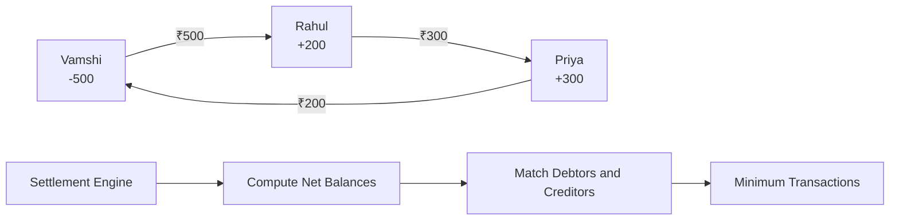
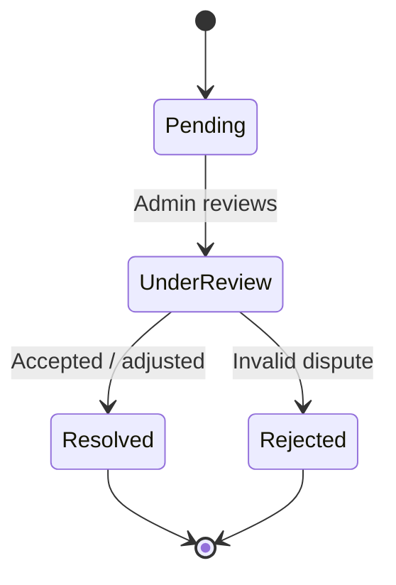
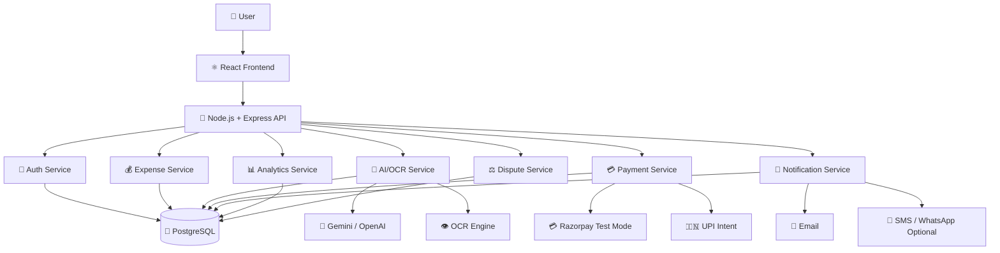
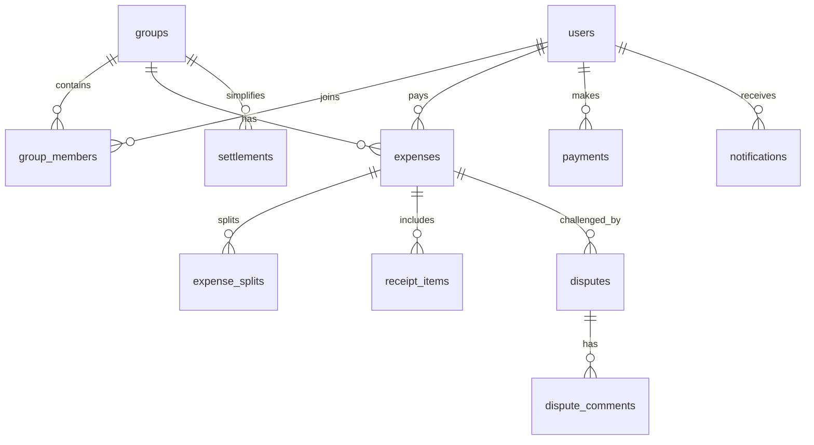
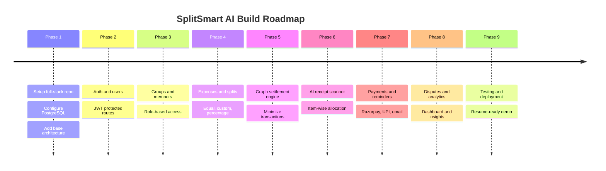
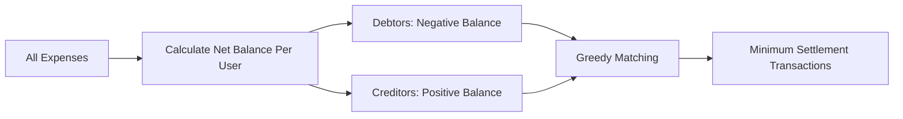

<div align="center">

# 💸 SplitSmart AI

### AI-Powered Intelligent Expense Splitting Platform

**Splitwise + AI Bill Scanner + UPI Settlements + Analytics + Dispute Handling**


**A production-style full-stack project built to demonstrate real SDE skills: authentication, database design, AI/OCR, payments, graph algorithms, analytics, notifications, and dispute workflows.**

[Core Idea](#-core-idea) •
[Features](#-features) •
[Tech Stack](#-tech-stack) •
[Architecture](#-system-architecture) •
[Database](#-database-design) •
[Build Phases](#-build-phases) •
[Resume Impact](#-resume-impact)

</div>

---

## 🎯 Core Idea

> **Most expense apps split totals. SplitSmart AI understands the bill, assigns items, simplifies debt, reminds users, tracks disputes, and explains spending behavior.**

SplitSmart AI helps groups manage shared expenses from start to settlement:

- 🧾 Upload a restaurant bill or receipt
- 🤖 Extract items, prices, tax, service charge, and total using AI/OCR
- 👥 Assign items to people
- 🧮 Split by equal, custom, percentage, or item-wise logic
- 🔁 Manage recurring expenses and shared subscriptions
- 📉 Simplify balances using graph algorithms
- 💳 Settle through Razorpay test mode, UPI intent, or manual confirmation
- 🔔 Send payment reminders with overdue tracking
- ⚖️ Raise and resolve disputes
- 📊 View spending analytics and AI insights

---

## ✨ Features

### 1. 👥 Group Expense Management

| Feature | Description |
| --- | --- |
| 🏘️ Groups | Create groups for trips, roommates, events, teams, or subscriptions |
| 👤 Members | Add friends and manage group members |
| 🛡️ Roles | Group admin and member permissions |
| 💰 Expenses | Add payer, amount, category, date, notes, and receipt |
| 📌 Balances | Track who paid, who owes, and group-level dues |

### 2. ⭐ AI Bill Scanner

Users upload a bill image. The AI scanner extracts structured data from the receipt.

| Extracted Field | Example |
| --- | --- |
| 🍕 Items | Pizza, Coke, Veg Meals |
| 💵 Prices | ₹450, ₹80, ₹220 |
| 🧾 Tax | GST, VAT, restaurant tax |
| 🍽️ Service Charge | 5% or fixed service fee |
| 🎯 Total | Final payable amount |

Example item allocation:

| Bill Item | Assigned To | Split Style |
| --- | --- | --- |
| 🍕 Pizza | Vamshi, Rahul | Shared equally |
| 🥤 Coke | Rahul | Rahul only |
| 🍱 Veg Meals | Priya | Priya only |
| 🧾 Service Charge | Everyone | Proportional |

### 3. 🧠 Smart Split Logic

| Split Mode | Use Case |
| --- | --- |
| ⚖️ Equal Split | Everyone pays the same amount |
| 🎛️ Custom Split | Manually enter exact amounts |
| 📊 Percentage Split | Split by percentage contribution |
| 🧾 Item-wise Split | Assign receipt items to people |
| 🔁 Recurring Split | Rent, subscriptions, monthly bills |
| 📦 Shared Subscription | Netflix, Spotify, cloud tools, etc. |

### 4. 📉 Balance Simplification

Instead of showing messy repayment chains, SplitSmart AI calculates minimum practical settlements.

```text
Before simplification:
A owes B ₹500
B owes C ₹300
C owes A ₹200

After simplification:
A owes B ₹300
B owes C ₹300
```

This is powered by a **net-balance graph algorithm**:



### 5. 🔔 Payment Reminders

- 📅 Due dates
- 📧 Email reminders
- 📱 Optional WhatsApp/SMS reminders
- ⏰ Reminder frequency: once, daily, weekly, custom
- 🚨 Overdue status
- 🗂️ Notification history

### 6. 💳 UPI and Payment Integration

| Payment Flow | Status |
| --- | --- |
| 🧪 Razorpay test mode | Planned |
| 🇮🇳 UPI intent links | Planned |
| ✅ Mark as paid | Planned |
| 📜 Payment history | Planned |
| 🧾 Settlement receipt | Planned |

### 7. ⚖️ Dispute System

When someone disagrees with an expense, they can raise a dispute.



Dispute features:

- 📝 Raise dispute with reason
- 💬 Comment thread
- 📎 Optional evidence
- 🛡️ Admin resolution
- ✅ Status: pending, under review, resolved, rejected

### 8. 📊 Analytics Dashboard

| Dashboard Metric | What It Shows |
| --- | --- |
| 📆 Monthly spending | Spending over time |
| 🏘️ Group-wise spending | Which groups cost the most |
| 🏷️ Category spending | Food, travel, rent, subscriptions |
| 🥇 Top spender | Highest spender in a group |
| ⏳ Pending dues | Unpaid balances |
| 📈 Settlement trends | How quickly people settle |

### 9. 🤖 AI Spending Insights

AI-generated insights can explain behavior in natural language:

> "You spent 42% more on food this month."

> "Your group's highest shared expense category is travel."

> "Rahul usually delays settlements by more than 5 days."

> "Subscriptions increased compared to last month."

### 10. 🔐 Authentication and Roles

- JWT authentication
- Password hashing with bcrypt
- Refresh token support
- Protected API routes
- Google login optional
- Group admin/member access control

---

## 🛠️ Tech Stack

### Frontend

| Technology | Purpose |
| --- | --- |
| ⚛️ React | Frontend UI |
| 🎨 Tailwind CSS | Styling |
| 🧭 React Router | Routing |
| 🔄 Axios / TanStack Query | API communication |
| 📊 Recharts | Analytics charts |
| ✅ React Hook Form + Zod | Forms and validation |

### Backend

| Technology | Purpose |
| --- | --- |
| 🟢 Node.js | Runtime |
| 🚂 Express.js | REST API |
| 🔐 JWT | Authentication |
| 🔒 Bcrypt | Password hashing |
| 📦 Multer | Receipt uploads |
| 📧 Nodemailer | Email reminders |
| 🧪 Zod / Joi | Request validation |

### Database and Services

| Technology | Purpose |
| --- | --- |
| 🐘 PostgreSQL | Relational database |
| 🔷 Prisma ORM | Schema and migrations |
| 🤖 Gemini API / OpenAI API | AI extraction and insights |
| 👁️ Google Vision / Tesseract.js | OCR |
| 💳 Razorpay | Test payment flow |
| ☁️ Cloudinary / S3 | Receipt storage |

---

## 🏗️ System Architecture



---

## 🧬 Database Design

| Table | Purpose |
| --- | --- |
| 👤 users | User accounts, auth data, profile details |
| 🏘️ groups | Expense groups |
| 👥 group_members | Users inside groups with roles |
| 💰 expenses | Expense records |
| 🧾 expense_splits | Who owes what for each expense |
| 🍽️ receipt_items | Extracted bill items |
| 💳 payments | Payment attempts and completed payments |
| 🔁 settlements | Simplified settlement records |
| ⚖️ disputes | Disputes on expenses or splits |
| 💬 dispute_comments | Dispute discussion |
| 🔔 notifications | Reminder logs |
| 📸 receipts | Uploaded receipt metadata and OCR data |
| 🔄 recurring_expenses | Recurring bills and subscriptions |
| 🧾 audit_logs | Important financial/admin actions |

### Entity Relationship Diagram



---

## 🔌 API Modules

| Module | Sample Routes |
| --- | --- |
| 🔐 Auth | `POST /api/auth/register`, `POST /api/auth/login`, `GET /api/auth/me` |
| 👤 Users | `GET /api/users/search`, `PATCH /api/users/me` |
| 🏘️ Groups | `POST /api/groups`, `GET /api/groups/:groupId` |
| 💰 Expenses | `POST /api/groups/:groupId/expenses`, `GET /api/expenses/:expenseId` |
| 🧾 Receipts | `POST /api/receipts/upload`, `POST /api/receipts/:id/extract` |
| 🔁 Settlements | `GET /api/groups/:id/balances`, `POST /api/groups/:id/simplify` |
| 💳 Payments | `POST /api/payments/razorpay/order`, `POST /api/payments/upi-intent` |
| ⚖️ Disputes | `POST /api/expenses/:id/disputes`, `PATCH /api/disputes/:id/resolve` |
| 📊 Analytics | `GET /api/analytics/monthly`, `GET /api/analytics/insights` |

---

## 🧭 Build Phases

| Phase | Focus | Deliverable |
| --- | --- | --- |
| ✅ Phase 1 | Project setup | React, Express, PostgreSQL, folder structure |
| 🔐 Phase 2 | Authentication | JWT login/register, protected routes |
| 👥 Phase 3 | Groups | Groups, members, roles |
| 💰 Phase 4 | Expenses | Add expenses and split logic |
| 📉 Phase 5 | DSA algorithm | Balance simplification |
| 🧾 Phase 6 | AI scanner | Receipt OCR and item-wise split |
| 💳 Phase 7 | Payments | Razorpay test mode and UPI intent |
| 🔔 Phase 8 | Reminders | Email reminders and overdue tracking |
| ⚖️ Phase 9 | Disputes | Raise, comment, resolve disputes |
| 📊 Phase 10 | Analytics | Spending dashboard |
| 🤖 Phase 11 | AI insights | Natural language spending insights |
| 🚀 Phase 12 | Polish + deploy | Testing, seed data, deployment, demo |

### Roadmap Flow



---

## 🧮 Key Algorithm: Settlement Simplification

### Problem

In group expenses, many people owe each other money. Showing every transaction makes settlement confusing.

### Solution

Use net balances and match debtors with creditors.



### High-Level Steps

1. Add paid amount to payer balance
2. Subtract owed amount from participants
3. Separate users into debtors and creditors
4. Match smallest debtor/creditor amounts
5. Generate final settlement transactions

This makes the project stronger in interviews because it connects **graphs, greedy logic, and real financial workflows**.

---

## 📁 Suggested Folder Structure

```text
splitsmart-ai/
  client/
    src/
      components/
      pages/
      routes/
      hooks/
      services/
      store/
      utils/
  server/
    src/
      config/
      controllers/
      middleware/
      modules/
        auth/
        users/
        groups/
        expenses/
        receipts/
        settlements/
        payments/
        disputes/
        analytics/
        notifications/
      services/
      utils/
      app.js
      server.js
    prisma/
      schema.prisma
      migrations/
  docs/
    api.md
    architecture.md
  README.md
```

---

## 🔐 Security Considerations

- 🔒 Hash passwords using bcrypt
- 🔑 Store JWT secrets in environment variables
- ✅ Validate all request bodies
- 🛡️ Enforce role-based group access
- 🚫 Prevent users from accessing unrelated groups
- 💳 Verify Razorpay payment signatures
- 🧾 Validate AI-extracted receipt totals before saving
- 🕵️ Maintain audit logs for financial changes
- 🙈 Do not store sensitive payment details directly

---

## 🚀 Deployment Plan

| Layer | Recommended Platform |
| --- | --- |
| ⚛️ Frontend | Vercel / Netlify |
| 🚂 Backend | Render / Railway / Fly.io |
| 🐘 PostgreSQL | Supabase / Neon / Railway / Render |
| 📸 File Storage | Cloudinary / S3 |
| 🔐 Secrets | Platform environment variables |

---

## 🏆 Resume Impact

### SplitSmart AI — AI-Powered Expense Splitting Platform

Built a full-stack expense management platform with group-based bill splitting, AI-powered receipt scanning, item-wise expense allocation, payment reminders, settlement tracking, dispute management, and spending analytics. Implemented graph-based balance simplification to minimize transactions and integrated Razorpay test payments with secure JWT authentication.

### Why This Is Placement-Level

| Skill Area | Demonstrated Through |
| --- | --- |
| 💻 Full-stack development | React frontend + Express backend |
| 🗄️ Database design | PostgreSQL relational schema |
| 🔐 Auth | JWT, bcrypt, protected routes |
| 🤖 AI integration | OCR and AI spending insights |
| 🧮 DSA | Graph-based settlement simplification |
| 💳 Payments | Razorpay test mode and UPI intent |
| 📊 Analytics | Recharts dashboard and trends |
| 🔔 Product thinking | Reminders, disputes, receipts, overdue status |
| 🧪 Engineering maturity | Validation, tests, audit logs, deployment plan |

```text
Original Splitwise Clone: Easy → Medium
SplitSmart AI: Medium-Hard, Resume-Ready, Interview-Friendly
```

---

## 🌟 Future Enhancements

- 🔑 Google login
- 📱 React Native mobile app
- 🔔 Push notifications
- 🌍 Multi-currency support
- 📄 PDF receipt export
- 💼 Budget planning
- 🕵️ Fraud/anomaly detection
- 🏦 Bank statement import
- 🎙️ Voice-based expense entry
- 🧑‍💼 Admin monitoring dashboard

---

<div align="center">

## ⭐ Project Status

**Planning and architecture phase completed.**

The repository now contains a complete product vision, system architecture, database plan, API modules, implementation phases, and resume positioning for building SplitSmart AI into a placement-level full-stack project.

### Made for strong SDE portfolio impact 🚀

</div>
