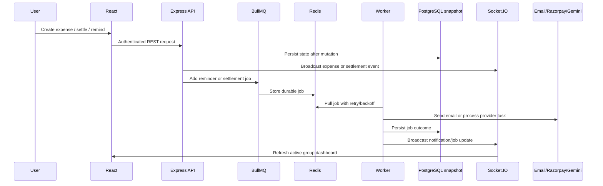

# Architecture Notes

SplitSmart AI starts as a two-package workspace:

- `client`: Vite React dashboard with expense entry, balances, settlement view, receipt extraction preview, and analytics.
- `server`: Express API with seeded data, JWT-based demo auth, request validation, Redis-backed job queues, Socket.IO events, and settlement simplification logic.

The current settlement engine calculates net balances by crediting payers and debiting each participant's split. It then applies completed settlement payments and greedily matches debtors to creditors to produce practical repayment instructions.

Analytics are calculated from group-local expenses and payment history, producing category totals, monthly totals, top payer, settlement counts, and natural-language spending signals.

The deployed backend uses a lightweight PostgreSQL persistence layer that snapshots the current product state to Neon after successful mutations and restores it on startup. This keeps the live demo durable while leaving room to replace the snapshot layer with full Prisma models later.

## Request, Queue, and Realtime Flow

## Services

| Service | Responsibility |
| --- | --- |
| Express API | Validates requests, applies auth, coordinates expense/payment/reminder mutations. |
| Settlement engine | Computes net balances and minimum practical repayment transactions. |
| BullMQ workers | Handle reminder emails and settlement processing with retry/backoff. |
| Redis | Queue broker for asynchronous jobs. |
| Socket.IO gateway | Pushes expense, settlement, and notification updates to active clients. |
| PostgreSQL snapshot store | Persists demo application state after successful mutations. |
| External providers | Gemini for AI/OCR, Cloudinary for receipts, Razorpay/UPI for payments, SMTP for email. |

## Payment Flow

1. The client requests a Razorpay order or UPI intent for an outstanding settlement.
2. The API validates that the settlement is still outstanding for the selected users and amount.
3. Razorpay confirmations verify the payment signature when a live/test secret is configured, or validate mock order IDs in local mode.
4. Completed settlement payments are recorded and applied to future balance calculations.
5. A settlement job is queued and realtime events notify connected dashboards.

The next major structural step is replacing snapshot persistence with full Prisma models while preserving the current API surface.
